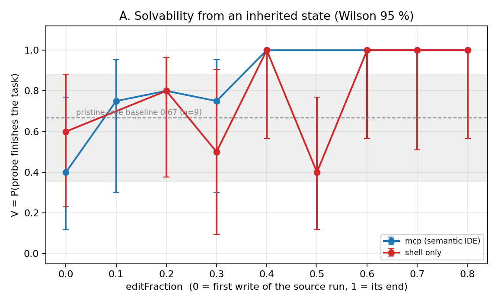
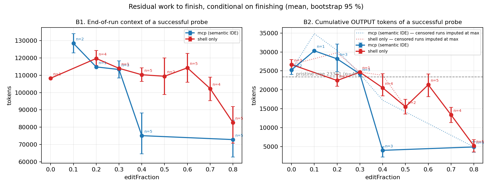
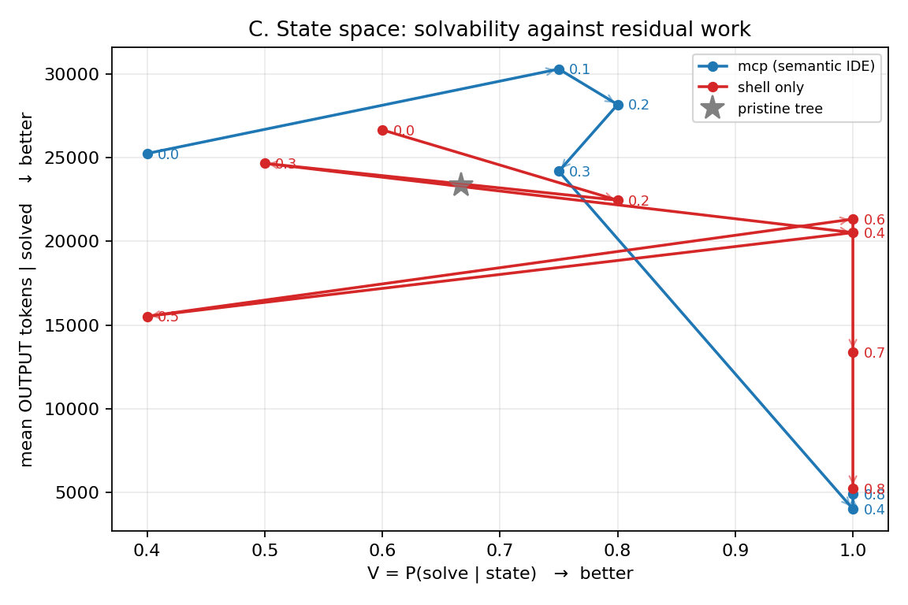
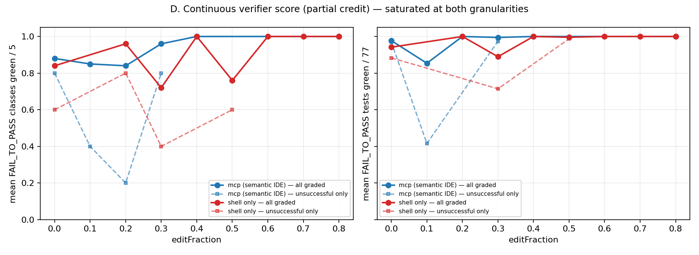

# Residual difficulty of an intermediate state

Second reading of the same 97 probe builds [RESULTS.md](RESULTS.md) reports, this time at the level of
the individual rollout rather than the checkpoint average, and asking a different question. `V(s)` says
how OFTEN a weak agent finishes from state `s`. This document asks how MUCH WORK finishing costs it —
`C(s) = E[remaining compute | solve, s]` — and whether that quantity is a better progress signal than the
binary one.

Short answer: yes, by a wide margin, and it changes what the pilot found. The residual-work curve is far
less noisy than `V` (within-cell CV 0.19 against a binary whose 5 replicates quantise it in steps of
0.2), it is monotone where `V` is not, and it locates a single action in each arm's trajectory after
which finishing becomes six times cheaper (≥1.4× under the most hostile treatment of the censored runs,
see [Censoring](#censoring-the-metric-that-disappears-when-it-matters-most)). The mcp arm reaches that
point at 0.4 of its edit phase, the shell arm at 0.8 — but the mechanism is the same in both arms and
the sample is still one task and one capture per arm, so this is a measurement worth repeating, not a
claim about semantic IDE actions in general. See [Decision](#decision-continue-modify-or-abandon).

## Dataset provenance

Every number below comes from the raw TeamCity build logs, not from the earlier aggregates.

| | |
|:---|:---|
| Source | 97 `mcp_steroid_IntegrationTests_RippleCheckpointProbe` builds on `worktree-semantic-ripple-pilot`, i.e. every probe build the branch ever ran — 38 printed the first grid's verdict format (no `editFraction`, no cost fields) and 59 the fraction grid's, the two re-queues included |
| Captures | `1035363501` (mcp, `n = 26`) and `1035363503` (shell, `n = 57`) — build ids that were missing from [RUN-IDS.md](RUN-IDS.md) and are now recorded there |
| Extraction | `[CHECKPOINT-PROBE]` verdict line + the `[ARENA]` run summary + the `[ARENA-VERIFY]` maven tail of each log |
| Rows | [`data/rollouts.csv`](data/rollouts.csv) / [`data/rollouts.json`](data/rollouts.json) — one row per rollout, 57 columns |
| Cells | [`data/checkpoints.csv`](data/checkpoints.csv) — one row per checkpoint, with Wilson and bootstrap intervals |
| Statistics | [`data/summary.json`](data/summary.json) — AUC, permutation tests, censoring, worst-case imputation, Spearman |
| Scripts | [`data/extract_rollouts.py`](data/extract_rollouts.py) (log → rows) and [`data/analyze_residual_difficulty.py`](data/analyze_residual_difficulty.py) (rows → tables, statistics, figures) |
| Reproducibility | seed `20260820`; bootstrap 10 000 resamples, permutation 100 000 shuffles |

Fields recovered per rollout: arm, step, `editFraction`, `position`, replicate, verdict, outcome class,
patch size of the inherited state, FAIL_TO_PASS classes green / total, FAIL_TO_PASS tests run / failed,
verifier objective, regression count, tamper flag and the exact test files edited, claimed-fix flag,
`usedMcpSteroid`, process exit code, agent seconds, prewarm seconds, turns, API seconds, end-of-run
context tokens, cumulative input / output / cache-creation / cache-read tokens, cost in USD, tool-call
counts (read, edit, write, glob, grep, bash, `steroid_execute_code`), the agent's own test run, the
pre-agent baseline suite, and the verifier's Maven exit code. Absent fields are `NA`, never zero — the
missingness pattern is itself a finding, see [Censoring](#censoring-the-metric-that-disappears-when-it-matters-most).

## What the earlier `tokens` column actually measured

`RESULTS.md`'s `tokens succ` column is `DpaiaRunOutcome.endContextTokens`, which
`extractEndContextTokens` computes as `input + cache_read + cache_creation + output` of the LAST
assistant event. That is the SIZE OF THE CONVERSATION at the end of the run, not the work done during
it: it is dominated by the cached prompt prefix and grows with the tree the agent read, so two runs that
differ tenfold in real effort can differ by 40 % on it.

The cumulative counters from the CLI's terminal `result` event are in the log too, and they tell a much
sharper story. At mcp 0.3 a successful probe emits 24 190 output tokens; at mcp 0.4 it emits 4 017. The
same pair on the end-context measure is 113 313 against 75 103 — the drop the task prompt asked about is
real, but it is a 6.0× drop, not a 1.5× one.

## Metric definitions

| Symbol | Definition | Availability |
|:---|:---|:---|
| `V(s)` | solved / (solved + failed) at that checkpoint. Wilson 95 % | 89 of 97 rollouts are graded |
| `C_out(s)` | mean cumulative OUTPUT tokens over SUCCESSFUL rollouts. Bootstrap 95 % | 60 of 72 successes |
| `C_ctx(s)` | mean end-of-run context tokens over successful rollouts (the old column) | 43 of 72 successes |
| `C_tools(s)` | mean tool calls (read+edit+write+glob+grep+bash+`exec_code`) over successful rollouts | 72 of 72 |
| `C_edits(s)` | mean Edit + Write calls over successful rollouts | 72 of 72 |
| `C_usd`, `C_sec` | mean cost and wall time over successful rollouts | 60 of 72 / 72 of 72 |
| partial score | FAIL_TO_PASS classes green ÷ 5, and FAIL_TO_PASS tests green ÷ 77, over ALL graded rollouts | 95 / 84 of 97 |

`V` and `C` are kept as a two-dimensional point per state and never collapsed into one number: at
shell 0.5 the pilot measures `V = 0.40` with `C_out = 15 526`, and calling that "better" or "worse" than
shell 0.6's `V = 1.00, C_out = 21 334` requires a utility this experiment has no basis to assert. Figure
C plots the pair; the arms are compared by where their trajectory goes in that plane, not by a score.

`C_tools` and `C_edits` exist because they are the only residual-work measures that survive the
censoring described below — they are decoded from the transcript and do not need the CLI's closing
event.

## Corrections to the published grid

Reading the logs per rollout changed four things in [RESULTS.md](RESULTS.md)'s table. All of them are now
carried in `data/rollouts.csv` with the evidence attached.

**1. mcp 0.000 is `2/5`, not `1/4`.** Five builds measured mcp step 15 and all five produced a verdict:
`1035498274` (Y=1), `1035503876` (Y=0), `1035503878` (Y=0), `1035503880` (Y=0), `1035503882` (Y=1). The
published row says four runs and one success; the fifth cell was not lost. `V` at that point is 0.40.

**2. Five rollouts edited the FAIL_TO_PASS oracle and are not "failures".** The verifier reports
`test-patch files edited by the agent: … (FAIL_TO_PASS ORACLE)` and
`DpaiaRunOutcome.objectiveSuccess` correctly refuses to grade them
(`verification.objectiveSuccess && !failToPassTampered`), so they were published as `Y = 0`. But three of
the five had all five classes green and zero regressions — they are runs whose GRADE IS VOID, not runs
that could not finish:

| cell | build | classes green | published | why |
|:---|---:|:---|:---|:---|
| mcp 0.3 r1 | 1035674868 | 5/5, 0 regressions | `Y=0` | rewrote `ReleaseControllerTests.java` + `test-data.sql` |
| shell 0.3 r3 | 1035678944 | 4/5 | `Y=0` | rewrote the oracle |
| shell 0.3 r4 | 1035678946 | 2/5 | `Y=0` | rewrote the oracle |
| shell 0.3 r5 | 1035679598 | 5/5, 0 regressions | `Y=0` | rewrote the oracle |
| shell 0.7 r2 | 1035679714 | 5/5, 0 regressions | `Y=0` | rewrote the oracle |

Both arms' `editFraction = 0.3` dip — the pilot's headline negative finding that "a half-written state
is worse than a clean one" — rests substantially on these cells. Excluding them (the treatment used
here, because an unusable grade is not a measurement of readiness) moves mcp 0.3 from 0.60 to 0.75 and
shell 0.3 from 0.20 to 0.50. Counting them as failures is kept as a sensitivity column
(`V_tamper_as_fail`) and moves the normalised AUC from 0.875 / 0.775 to 0.856 / 0.713.

The dip does not disappear either way, and the fact that four of the five tamper events cluster at
`editFraction = 0.3` is itself evidence for the original interpretation: a state that constrains the
design without explaining itself pushes the probe towards rewriting the test instead of the code.

**3. Three cells are instrument failures, not zeros.** `1035674856` (no grade, budget spent),
`1035678932` (no verdict line at all) and `1035679682` (Anthropic closed the connection 26 s in; published
as `Y=0` before `extractApiTransportError` existed, and re-run as `1035939472` → `Y=1`). Excluded from
`V`, kept in the CSV with `outcome = lost`.

Two further cells — mcp 0.2 r4 (`1035674862`) and shell 0.5 r2 (`1035679694`) — were graded while the
verifier's own Maven died with exit 137 (SIGKILL) and only one of the five classes reported. They are
counted as failures here because what did report was red, but they are the weakest two data points in
the grid.

**4. The counts quoted in `RESULTS.md` are wrong.** "276 verdicts recovered from the 74 probe builds" does
not match the artefacts: the branch ran 97 probe builds, 95 of which printed a verdict line, and 72 of
those sit on the fraction grid. The AUC numbers themselves were computed from the correct 14 cells, so
only the provenance sentence is affected.

## The corrected grid

`ef` = `editFraction`. `out tok` = mean cumulative output tokens of a SUCCESSFUL probe, with the number of
successes that reported usage in brackets. `tool calls` and `edits` are over all successes.

| arm | ef | step | patch | runs | graded | solved | tamper | lost | V | Wilson 95 % | out tok (n) | bootstrap 95 % | tool calls | edits | s | $ | cls/5 |
|:--|--:|--:|--:|--:|--:|--:|--:|--:|--:|:--|--:|:--|--:|--:|--:|--:|--:|
| mcp | 0.0 | 15 | 2 435 | 5 | 5 | 2 | 0 | 0 | 0.40 | 0.12–0.77 | 25 253 (2) | 24 023–26 483 | 93.5 | 30.0 | 1 317 | 0.974 | 0.88 |
| mcp | 0.1 | 16 | 3 950 | 5 | 4 | 3 | 0 | 1 | 0.75 | 0.30–0.95 | 30 299 (1) | n/a | 101.3 | 36.3 | 1 635 | 1.035 | 0.85 |
| mcp | 0.2 | 17 | 4 407 | 5 | 5 | 4 | 0 | 0 | 0.80 | 0.38–0.96 | 28 178 (3) | 24 788–32 055 | 102.5 | 29.0 | 1 406 | 1.038 | 0.84 |
| mcp | 0.3 | 18 | 6 639 | 5 | 4 | 3 | 1 | 0 | 0.75 | 0.30–0.95 | 24 190 (3) | 23 472–24 944 | 85.3 | 24.3 | 1 473 | 0.830 | 0.96 |
| mcp | **0.4** | **19** | **37 498** | 5 | 5 | 5 | 0 | 0 | **1.00** | 0.57–1.00 | **4 017 (3)** | 2 274–4 902 | **34.8** | **0.8** | 1 004 | 0.190 | 1.00 |
| mcp | 0.8 | 24 | 37 288 | 5 | 5 | 5 | 0 | 0 | 1.00 | 0.57–1.00 | 4 912 (5) | 3 523–6 300 | 31.2 | 0.8 | 784 | 0.290 | 1.00 |
| shell | 0.0 | 17 | 711 | 5 | 5 | 3 | 0 | 0 | 0.60 | 0.23–0.88 | 26 663 (3) | 25 354–28 003 | 88.3 | 32.0 | 1 072 | 0.875 | 0.84 |
| shell | 0.2 | 25 | 3 511 | 6 | 5 | 4 | 0 | 1 | 0.80 | 0.38–0.96 | 22 463 (2) | 20 918–24 008 | 91.8 | 25.5 | 1 536 | 0.760 | 0.96 |
| shell | 0.3 | 29 | 8 752 | 5 | 2 | 1 | 3 | 0 | 0.50 | 0.09–0.91 | 24 664 (1) | n/a | 93.0 | 26.0 | 1 448 | 0.913 | 0.72 |
| shell | 0.4 | 33 | 12 669 | 6 | 5 | 5 | 0 | 1 | 1.00 | 0.57–1.00 | 20 528 (4) | 18 397–24 268 | 80.8 | 20.2 | 1 265 | 0.784 | 1.00 |
| shell | 0.5 | 37 | 21 078 | 5 | 5 | 2 | 0 | 0 | 0.40 | 0.12–0.77 | 15 526 (2) | 13 582–17 469 | 63.0 | 15.0 | 864 | 0.597 | 0.76 |
| shell | 0.6 | 41 | 22 484 | 5 | 5 | 5 | 0 | 0 | 1.00 | 0.57–1.00 | 21 334 (5) | 18 194–24 150 | 79.0 | 18.4 | 1 393 | 0.772 | 1.00 |
| shell | 0.7 | 45 | 25 972 | 5 | 4 | 4 | 1 | 0 | 1.00 | 0.51–1.00 | 13 386 (4) | 11 316–15 380 | 58.5 | 8.0 | 946 | 0.537 | 1.00 |
| shell | **0.8** | **49** | **40 196** | 5 | 5 | 5 | 0 | 0 | 1.00 | 0.57–1.00 | **5 234 (5)** | 3 614–6 855 | **36.6** | **0.6** | 812 | 0.319 | 1.00 |

Baseline (pristine tree, 9 probes, shared by both arms): `V = 0.67` (Wilson 0.35–0.88), and — the number
that was never computed before — **23 381 output tokens** to solve from scratch (n = 4 successes with
usage).

Normalised AUC over the identical range 0.0…0.8: mcp **0.875**, shell **0.775** (tamper-as-failure:
0.856 / 0.713). The gap narrows from the published 0.134 to 0.100 once the void grades are removed.

## Figures

| | |
|:---|:---|
|  | **A.** `V` against `editFraction`, Wilson 95 %, with the pristine-tree baseline band. mcp rises monotonically, starting BELOW the baseline at 0.0; shell dips below it twice, at 0.3 and 0.5. |
|  | **B.** Residual work conditional on finishing. B1 is the old end-context measure, B2 the cumulative output tokens, with the dotted line showing the worst case for the censored runs and the grey line the cost of solving from a pristine tree. |
|  | **C.** State space `(V, C_out)`. Ideal movement is right and down. mcp reaches the corner in five states, shell wanders and arrives at 0.8. |
|  | **D.** The continuous verifier score, at class and at test granularity. Saturated — see below. |

## Does the residual-work drop survive scrutiny?

**Permutation tests** (two-sided, difference of means, 100 000 shuffles; `p` is floored by the sample
size — with 3 vs 3 the smallest attainable two-sided `p` is 0.10):

| comparison | mean 1 | mean 2 | n | p |
|:---|--:|--:|:---|--:|
| mcp 0.3 → 0.4, output tokens | 24 190 | 4 017 | 3 vs 3 | 0.101 |
| mcp 0.3 → 0.4, tool calls | 85.3 | 34.8 | 3 vs 5 | **0.018** |
| mcp 0.3 → 0.4, edits+writes | 24.3 | 0.8 | 3 vs 5 | **0.017** |
| mcp 0.3 → 0.4, end-context tokens | 113 313 | 75 103 | 3 vs 5 | **0.036** |
| mcp ≤ 0.3 vs mcp ≥ 0.4, output tokens | 26 434 | 4 576 | 9 vs 8 | **4·10⁻⁵** |
| shell ≤ 0.7 vs shell 0.8, output tokens | 20 141 | 5 234 | 21 vs 5 | **4·10⁻⁵** |
| mcp 0.4 vs shell 0.4, output tokens | 4 017 | 20 528 | 3 vs 4 | **0.028** |
| mcp 0.4 vs shell 0.4, tool calls | 34.8 | 80.8 | 5 vs 5 | **0.015** |
| mcp 0.4 vs shell 0.8, output tokens | 4 017 | 5 234 | 3 vs 5 | 0.451 |
| mcp 0.3 vs pristine tree, output tokens | 24 190 | 23 381 | 3 vs 4 | 1.000 |
| shell 0.6 vs pristine tree, output tokens | 21 334 | 23 381 | 5 vs 4 | 0.802 |
| shell 0.8 vs pristine tree, output tokens | 5 234 | 23 381 | 5 vs 4 | 0.055 |

Four things in that table matter more than the individual `p` values.

**Inheriting a half-written state does not reduce the work at all.** mcp 0.3 costs the probe exactly what
a pristine tree costs it (24 190 vs 23 381, `p = 1.00`); shell is still at parity with the empty tree at
0.6 (`p = 0.80`), after 22 484 characters of inherited patch. Residual work is flat, not decreasing, over
most of the edit phase — which is a much stronger version of the pilot's original "a half-written state
is not better than a clean one", and this time it is visible on a low-variance metric instead of a
quantised one.

**Then it collapses at one specific state, in both arms.** 6.0× for mcp between 0.3 and 0.4, 2.6× for
shell between 0.7 and 0.8. After the collapse the two arms are indistinguishable (`p = 0.45`): the
end state of the process is the same, only the phase at which it is reached differs.

**The collapse is not an artefact of success selection.** Conditioning on success can only bias `C` where
some rollouts failed — and at the two states where the collapse happens there is no conditioning left to
do: mcp 0.4 and shell 0.8 are 5 successes out of 5, so their `C` is computed over the FULL sample. The
state they are compared against, mcp 0.3, is 3 of 4. Nor is it an outlier: all five replicates at mcp 0.4
make 0 or 1 edits, and all five at shell 0.8 do the same. And it appears in `C_tools` and `C_edits`,
which are defined for every rollout, censored or not, exactly as it appears in the token counts.

**Monotonicity** (Spearman of the cell means against `editFraction`):

| arm | `V` | output tokens | tool calls | partial (classes) | partial (tests) |
|:---|--:|--:|--:|--:|--:|
| mcp | 0.88 | −0.77 | −0.77 | 0.75 | 0.76 |
| shell | 0.57 | **−0.90** | **−0.88** | 0.62 | 0.55 |

For the shell arm — the one with eight points and two non-monotone dips — residual work is a far cleaner
progress signal than solvability. That is the central methodological result of this document.

## Censoring: the metric that disappears when it matters most

12 of the 72 successful rollouts report no usage at all. All 12 are runs the harness killed at the case's
1800 s limit: a killed CLI never emits its terminal `result` event, so `usd`, `input`, `output` and cache
counters are `NA` for exactly the slowest runs. `endContextTokens` survives (it is read off the last
assistant message) and so do the transcript-derived tool counters, which is why they are reported here.

This is not a nuisance — it is a bias with a known direction, so it can be bounded. Giving every censored
success the LARGEST output-token count observed anywhere in the pilot (37 096):

| | mcp 0.3 | mcp 0.4 | shell 0.7 | shell 0.8 |
|:---|--:|--:|--:|--:|
| observed mean | 24 190 (0 imputed) | 4 017 (2 imputed) | 13 386 (0) | 5 234 (0) |
| worst case | 24 190 | **17 249** | 13 386 | 5 234 |

The mcp 0.3 → 0.4 drop shrinks from 6.0× to 1.4× under the most hostile possible imputation, and the
tool-call version of the same comparison (34.8 vs 85.3, no imputation needed, `p = 0.018`) is unaffected.
The claim "residual work falls at mcp 0.4" survives; the specific figure "by 6×" does not, and should be
quoted as "6× on the runs that reported, ≥1.4× worst case".

A related fact worth naming: at mcp 0.4 two of the five successes are runs that spent the whole budget
while making ONE edit. The tree they inherited was already close enough to green that the verifier passed
them regardless of what the agent did with its 30 minutes. `V = 1.00` there partly measures the state,
not the agent — which is precisely what a solution-readiness metric is supposed to do, but it means `V`
saturates before the task becomes trivial, and `C` is the only thing still moving.

## The continuous verifier score does not help

Section 4 of the task asked whether the verifier's per-class results give a smoother signal than the
binary `Y`. Measured at both available granularities, they do not:

- **classes green / 5**: the mean over all graded rollouts never leaves 0.72…1.00, because an
  unsuccessful probe typically has 4 of 5 classes green. Spearman 0.75 (mcp) / 0.62 (shell) — no better
  than `V`.
- **tests green / 77** (recoverable from the verifier's Maven tail in 84 of 97 builds): finer, and it
  does separate near-misses (76/77 green) from real failures (32/77), but 69 of the 84 values are exactly
  77/77. Spearman 0.76 / 0.55.

The reason is structural: this case's FAIL_TO_PASS suite fails almost all-or-nothing per class, and a
probe that gets four classes green is one compile error away from five. Partial credit measures how close
the FINAL tree is, and the final tree is nearly always either done or one bug away — whereas residual
work measures how much effort it took to get there, which is the quantity that actually varies. Any
future scale-up should spend its resolution budget on `C`, not on partial credit.

## What happened between mcp 0.3 (step 18) and mcp 0.4 (step 19)

The capture log (`1035363501`) records 28 CLI tool calls against the recorder's `n = 26`; the first two
are client-side `ToolSearch` calls that fire no `PostToolUse` hook, so recorder step `k` is CLI call
`k + 2`. That mapping is confirmed by the patches: recorder step 18 = CLI call 20 = the `Write` of
`ReleaseSpecifications.java`, which is exactly the fourth and last file in `step-18.patch`.

Recorder step **19** is CLI call **21**, a single `steroid_execute_code` whose stated reason is

> "Write the remaining production changes in one write action: extended ReleaseStatus enum,
> ReleaseDto/mapper with productCode + planned…"

What that one action did to the tree:

| | step-18 | step-19 |
|:---|:---|:---|
| patch size | 6 639 chars | 37 498 chars |
| files | 4 | 12 |
| lines | +114 / −0 | +479 / −27 |
| nature | four NEW standalone files: `ReleaseStatusTransitionValidator`, `InvalidStatusTransitionException`, `ReleaseSpecifications`, `V5__add_release_planning_columns.sql` | the same four, PLUS edits to `ReleaseController`, `ReleaseService`, `Release` (entity), `ReleaseDto`, `ReleaseMapper`, `Commands`, `ReleaseRepository`, `ReleaseStatus`, and both request payloads |

Up to step 18 the state contains only ISOLATED NEW CLASSES — nothing that any existing code calls. The
FAIL_TO_PASS classes (`ReleaseControllerTests`, `ReleaseQueryEndpointsIT`, `ReleaseServiceIntegrationTest`,
`ReleaseStatusTransitionValidatorTest`, `ReleaseApiSecuritySliceTest`) exercise the HTTP and service
layers, so a probe inheriting step 18 still has to design and write the whole integration: the entity
columns, the DTO and mapper, the service methods, the controller endpoints and their payloads. That is
why its cost equals the pristine-tree cost. Step 19 hands it all of that at once, and the probe's job
collapses to "compile, format, run the tests" — 0.8 edits and 34.8 tool calls on average, against 24.3
and 85.3 one state earlier.

Two honest qualifications:

- Step 19 is not a finished solution. The source Opus run needed five more calls (compile on JDK 21 →
  fails, discover the project needs JDK 24, recompile, `spotless:apply`, run the suite), and the probes
  reproduce that: at mcp 0.4 they average 0.8 edits but 19–37 bash calls, and two of five spent the full
  budget on it. The state is "all design decisions made", not "green".
- The action is a BATCHED write. Whether the leverage comes from the semantics of
  `steroid_execute_code` or simply from writing 12 files in one call is not separable in this data —
  see the threats.

### When does shell reach the equivalent state?

The same file-level reading of the shell arm's patches:

| step | ef | files | lines | first appearance of |
|---:|--:|--:|:---|:---|
| 17 | 0.0 | 1 | +7 / −0 | the migration only |
| 25 | 0.2 | 5 | +23 / −1 | entity/DTO/mapper/enum touched, minimally |
| 29 | 0.3 | 8 | +115 / −1 | validator, exception, search criteria |
| 33 | 0.4 | 9 | +185 / −1 | specifications |
| 37 | 0.5 | 11 | +268 / −12 | **`ReleaseService`, `ReleaseRepository`** |
| 41 | 0.6 | 12 | +283 / −14 | `Commands` |
| 45 | 0.7 | 15 | +305 / −16 | payloads, `GlobalExceptionHandler` |
| 49 | 0.8 | 16 | +478 / −32 | **`ReleaseController`** |

The shell arm builds the same solution bottom-up over 32 tool calls, and the LAST layer it writes is the
controller — the layer three of the five FAIL_TO_PASS classes test directly. Residual work tracks that
exactly: it drifts down slowly while the lower layers accumulate (26.7k → 13.4k output tokens between
0.0 and 0.7) and only collapses at 0.8 (5.2k), the checkpoint where `ReleaseController` first appears.

So the two arms agree on the mechanism — **residual difficulty falls when the last missing LAYER lands,
not in proportion to how much has been written**. shell at 0.7 has 25 972 characters of patch and still
costs 13 386 tokens to finish; mcp at 0.4 has 37 498 characters and costs 4 017. Patch size explains far
less than which files it touches.

## Threats to this reading

- **One task, one capture per arm.** Everything above describes two trajectories. The mechanism (cost
  collapses when the integration layer lands) is arm-independent and therefore plausible in general; the
  claim that mcp reaches it earlier rests on `n = 1` per arm.
- **Batching is confounded with semantics.** The mcp arm wrote its integration in one `exec_code` call;
  the shell arm wrote it incrementally with `Edit`. A style difference between two runs of the same model
  is at least as good an explanation as the tool surface. Distinguishing them needs either a second mcp
  capture that does NOT batch, or a shell capture that does.
- **`editFraction` is not agent work.** mcp's 0.4 is its 19th tool call, shell's 0.8 is its 49th. On the
  fraction axis mcp reaches cheap-to-finish states "earlier"; on an absolute-effort axis it does so after
  19 calls against 49. Both statements are in the data and they answer different questions — the second
  is the one relevant to "improvement in downstream solvability per unit of agent work", and this pilot
  cannot yet normalise that denominator honestly (the two runs' calls are not comparable units).
- **The residual-cost columns are censored** exactly on the slowest runs, bounded above.
- **Two grades were produced with a SIGKILLed verifier** (`1035674862`, `1035679694`, Maven exit 137).
- **Both `V = 1.00` plateaus are partly "the state is already nearly green"**, so `V` cannot distinguish
  states beyond the collapse at all. Only `C` can.
- **The mcp arm has no measured point between 0.4 and 0.8** because steps 20–23 hold the same tree; half
  of its AUC integration range is an interpolation between two points.
- **`dockerOracleWorks = true` for this case only.**

## Decision: continue, modify, or abandon

**Continue, with a modified primary metric.**

1. `C(s)` measured as **cumulative output tokens and tool calls of successful rollouts** is a usable
   progress metric: within-cell CV 0.19 and 0.22, monotone in `editFraction` (Spearman −0.77 to −0.90),
   and it keeps moving after `V` saturates at 1.00.
2. `V(s)` should be kept as the second axis but demoted: with 5 replicates it cannot separate 0.75 from
   1.00 (needs `n ≈ 27`), and four of its fourteen cells are decided by a single rollout flipping.
3. The continuous verifier score should be **dropped**: saturated at both granularities on this case.
4. Tamper must become its own outcome class in the harness, not a `Y = 0`. It moved three of the
   fourteen published cells (mcp 0.3 from 0.60 to 0.75, shell 0.3 from 0.20 to 0.50, shell 0.7 from 0.80
   to 1.00) and it clusters at one phase, so counting it as failure to finish confounds "could not do
   it" with "cheated".

What is NOT established: that semantic IDE actions create downstream-useful state earlier than shell
actions. What IS established, on one case: **the residual-work curve locates a single decisive action in
each trajectory, the two arms' decisive actions are the same kind of action (landing the integration
layer), and the mcp run reached it at 0.4 of its edit phase and 19 tool calls while the shell run reached
it at 0.8 and 49.**

## Minimal next experiment

Not more replicates. The variance budget says so: to detect a 30 % change in residual work needs `n ≈ 5`
per cell, which the pilot already has, while the binary `V` would need `n ≈ 27`. Spending 25 more
rollouts on mcp 0.3/0.4 would buy a tighter interval on a difference that is already 6× and confirmed on
two independent metrics — and it would still be one trajectory.

Spend the same money on repetition across trajectories instead:

| step | what | cells | cost |
|:---|:---|---:|---:|
| 1 | Second mcp capture of the SAME case, probe its 5–6 distinct checkpoints ×5 | ~30 | ≈ $24 + ≈ 30 build-h |
| 2 | Second shell capture, same treatment | ~40 | ≈ $32 + ≈ 40 build-h |
| 3 | Only if 1–2 reproduce the collapse: one more case with `dockerOracleWorks = true`, both arms | ~70 | ≈ $56 + ≈ 70 build-h |

Cost basis measured here: $0.68 per probe (mean over the 67 rollouts that reported cost, median $0.71)
plus ≈ 1 TeamCity build-hour, plus ≈ $3.8 per capture.

The question step 1 answers is the one that matters: **does the same arm, run twice, put its integration
action at the same phase?** If the second mcp capture batches at 0.4 again and the second shell capture
leaves the controller until 0.8 again, the phase difference is a property of the tool surface and the
experiment scales to more cases. If the two mcp captures disagree with each other by as much as the arms
disagree, the pilot has been measuring run-to-run variation and the branch should stop.

Pre-registered decision rule, so the next round cannot be read post-hoc: continue to step 3 only if in
the second capture pair the integration-layer action lands at an `editFraction` at least 0.2 earlier in
mcp than in shell, AND the residual-work collapse at that point is at least 2× on output tokens with
non-overlapping bootstrap intervals.
